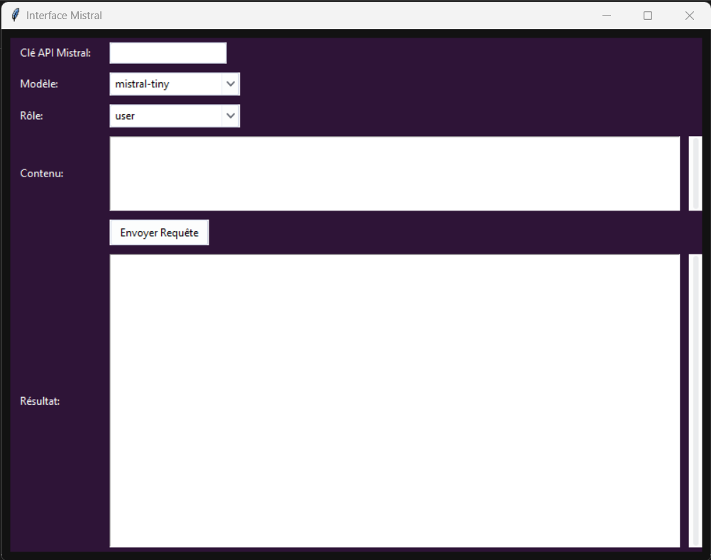

# Mistral API UI
 Local Python UI to use Mistral API

 # Setup

 ## For console (test.py)

```
pip install requests
python -m test
```

 ## For UI (testgraphic.py)
 ```
 pip install requests
 pip install tk
 pip install ttkthemes
 python -m testgraphic
 ```

